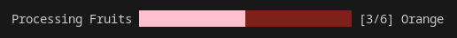
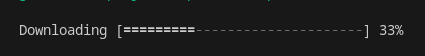
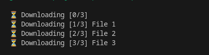

&nbsp;[OPEN TECH FOUNDATION](https://open-tech-foundation.pages.dev/)

<div align="center">

# @opentf/cli-pbar

[](https://github.com/open-tech-foundation/cli-progress-bar/actions/workflows/build.yml)

</div>

<div align="center">


</div>

> The Customizable CLI Progress Bars.

<div align="center">

**Try it online at [https://node-repl.pages.dev](https://node-repl.pages.dev/)**

</div>

---

🚀 [@opentf/std](https://js-std.pages.dev/) - An Extensive JavaScript Standard Library. Please review and give feedback.

Please read our important articles:

- [Introducing Our New JavaScript Standard Library](https://ganapathy.hashnode.dev/introducing-our-new-javascript-standard-library)

- [You Don’t Need JavaScript Native Methods](https://ganapathy.hashnode.dev/you-dont-need-javascript-native-methods)

---

## Features

- Single & Multi Progress Bars

- Customizable (colors, size, etc)

- TypeScript Support

## Installation

Install it using your favourite package manager.

```bash
npm install @opentf/cli-pbar
```

```bash
yarn add @opentf/cli-pbar
```

```bash
pnpm add @opentf/cli-pbar
```

```bash
bun add @opentf/cli-pbar
```

## Syntax

```ts
new ProgressBar(options?: Options)
```

## Usage

Single progress bar.

```ts
import { ProgressBar } from '@opentf/cli-pbar';

const pBar = new ProgressBar();
pBar.start({ total: 100 });
pBar.update({ value: 50 });
pBar.update({ value: 100 });
pBar.stop();
```

Multi progress bar.

```ts
import { ProgressBar } from '@opentf/cli-pbar';

const multiPBar = new ProgressBar({ size: 'MEDIUM' });
multiPBar.start();
const b1 = multiPBar.add({ total: 100 });
const b2 = multiPBar.add({ total: 100 });
const b3 = multiPBar.add({ total: 100 });
b1.update({ value: 23 });
b3.update({ value: 35 });
b2.update({ value: 17 });
multiPBar.stop();
```

> [!TIP]
> It is recommended to use the `MEDIUM` sized bars in multi progress bars to get better visuals.

## Examples

Using `inc()` to increment the progress bar value, hide the `percent` & show the `count`.

```js
import { sleep, aForEach } from '@opentf/std';
import { ProgressBar } from '@opentf/cli-pbar';

const arr = ['Apple', 'Mango', 'Orange', 'Grapes', 'Pear', 'Guava'];

const pBar = new ProgressBar({
  color: 'pi',
  bgColor: 'r',
  showPercent: false,
  showCount: true,
  prefix: 'Processing Fruits',
});

pBar.start({ total: arr.length });

await aForEach(arr, async (f) => {
  pBar.inc({ suffix: f });
  await sleep(500);
});

pBar.stop();
```



---

Rendering a plain variant progress bar.

```js
import { ProgressBar } from '@opentf/cli-pbar';

const pBar = new ProgressBar({
  variant: 'PLAIN',
  prefix: 'Downloading',
});

pBar.start({ total: 3 });
pBar.inc();
pBar.stop();
```



---

It does not render progress bars in non TTY terminals, like CI, etc.

```js
import { sleep, aForEach } from '@opentf/std';
import { ProgressBar } from '@opentf/cli-pbar';

const arr = ['File 1', 'File 2', 'File 3'];
const pBar = new ProgressBar({
  prefix: 'Downloading',
  showPercent: false,
  showCount: true,
});

pBar.start({ total: arr.length });

await aForEach(arr, async (f) => {
  pBar.inc({ suffix: f });
  await sleep(500);
});

pBar.stop();
```



## API

### options:

| Name        | Type        | Default        | Description                                                                                                                                                                                                                                                                                                                                              |
| ----------- | ----------- | -------------- | -------------------------------------------------------------------------------------------------------------------------------------------------------------------------------------------------------------------------------------------------------------------------------------------------------------------------------------------------------- |
| stream      | WriteStream | process.stderr | The [TTY](https://nodejs.org/docs/latest-v20.x/api/tty.html#class-ttywritestream) writable stream to use.                                                                                                                                                                                                                                                |
| width       | number      | 30             | The size of the progress bar.                                                                                                                                                                                                                                                                                                                            |
| prefix      | string      | ''             | The string to be prefixed progress bar.                                                                                                                                                                                                                                                                                                                  |
| suffix      | string      | ''             | The string to be suffixed progress bar.                                                                                                                                                                                                                                                                                                                  |
| color       | string      | 'g'            | The color to render the completed progress bar.<br />The default color is `green`.<br /> It uses [@opentf/cli-styles](https://www.npmjs.com/package/@opentf/cli-styles) for colors.<br />You can also use the `rgb` & `hex` color modes, please refer the [supported color keys here](https://github.com/open-tech-foundation/js-cli-styles#color-keys). |
| bgColor     | string      | 'gr'           | The color to render the incomplete progress bar.<br />The default color is `grey`.<br /> It uses [@opentf/cli-styles](https://www.npmjs.com/package/@opentf/cli-styles) for colors.<br />You can also use the `rgb` & `hex` color modes, please refer the [supported color keys here](https://github.com/open-tech-foundation/js-cli-styles#color-keys). |
| size        | string      | 'DEFAULT'      | The size of the progress bar to render.<br />Available sizes:<br/>'DEFAULT'<br/>'MEDIUM'<br/>'SMALL'                                                                                                                                                                                                                                                     |
| autoClear   | boolean     | false          | If true, then it auto-clears the progress bar after the `stop` method is called.                                                                                                                                                                                                                                                                         |
| showPercent | boolean     | true           | If false, then it hides the progress bar percent.                                                                                                                                                                                                                                                                                                        |
| showCount   | boolean     | false          | If true, then it show the progress bar count.                                                                                                                                                                                                                                                                                                            |
| variant     | string      | 'STANDARD'     | There are two variants available, `STANDARD` & `PLAIN`.                                                                                                                                                                                                                                                                                                  |

### Instance methods:

**start(obj?: Partial<Bar\>): void**

After the method is called, the progress bar starts rendering.

#### Bar:

| Name        | Type    | Default   | Description                                                                                                                                                                                                                                                                                                                                              |
| ----------- | ------- | --------- | -------------------------------------------------------------------------------------------------------------------------------------------------------------------------------------------------------------------------------------------------------------------------------------------------------------------------------------------------------- |
| total       | number  | NaN       | The total value for the progress bar.                                                                                                                                                                                                                                                                                                                    |
| value       | number  | NaN       | The current value of the progress bar.                                                                                                                                                                                                                                                                                                                   |
| prefix      | string  | ''        | The string to be prefixed progress bar.                                                                                                                                                                                                                                                                                                                  |
| suffix      | string  | ''        | The string to be suffixed progress bar.                                                                                                                                                                                                                                                                                                                  |
| color       | string  | 'g'       | The color to render the completed progress bar.<br />The default color is `green`.<br /> It uses [@opentf/cli-styles](https://www.npmjs.com/package/@opentf/cli-styles) for colors.<br />You can also use the `rgb` & `hex` color modes, please refer the [supported color keys here](https://github.com/open-tech-foundation/js-cli-styles#color-keys). |
| bgColor     | string  | 'gr'      | The color to render the incomplete progress bar.<br />The default color is `grey`.<br /> It uses [@opentf/cli-styles](https://www.npmjs.com/package/@opentf/cli-styles) for colors.<br />You can also use the `rgb` & `hex` color modes, please refer the [supported color keys here](https://github.com/open-tech-foundation/js-cli-styles#color-keys). |
| size        | string  | 'DEFAULT' | The size of the progress bar.<br />Available sizes:<br/>'DEFAULT'<br/>'MEDIUM'<br/>'SMALL'                                                                                                                                                                                                                                                               |
| progress    | boolean | true      | If `false`, it does not render a progress bar, making it useful to add an empty line or text without displaying a progress bar.                                                                                                                                                                                                                          |
| showPercent | boolean | true      | If false, then it hides the progress bar percent.                                                                                                                                                                                                                                                                                                        |
| showCount   | boolean | false     | If true, then it show the progress bar count.                                                                                                                                                                                                                                                                                                            |

### add(bar: Partial<Bar\>): { update: (bar: Partial<Bar\>) => void }

In `multi-progress`, it appends a progress bar to the container and returns an instance.

### update(bar: Partial<Bar\>): void

It is used to update the current progress bar instance.

### inc(bar: Partial<Bar\>): void

It increments the progress bar value and optionaly updates the other bar props.

### stop(msg?: string): void

Stops the current progress bar instance with the current state and optionally clears the progress bar when `autoClear` is true.

You can also pass `msg` text to be displayed after the instance stops.

## Supported Color Keys

| Key | Description                |
| --- | -------------------------- |
| r   | Red - rgb(255,65,54)       |
| g   | Green - rgb(46,204,64)     |
| b   | Blue - rgb(0,116,217)      |
| o   | Orange - rgb(255,133,27)   |
| y   | Yellow - rgb(255,220,0)    |
| w   | White - rgb(255,255,255)   |
| m   | Magenta - rgb(255,105,193) |
| c   | Cyan - rgb(154, 236, 254)  |
| n   | Navy - rgb(0,31,63)        |
| a   | Aqua - rgb(127,219,255)    |
| t   | Teal - rgb(57,204,204)     |
| p   | Purple - rgb(177,13,201)   |
| f   | Fuchsia - rgb(240,18,190)  |
| s   | Silver - rgb(221,221,221)  |
| ma  | Maroon - rgb(133,20,75)    |
| ol  | Olive - rgb(61,153,112)    |
| li  | Lime - rgb(1,255,112)      |
| bl  | Black - rgb(17,17,17)      |
| gr  | Grey - rgb(170,170,170)    |
| pi  | Pink - rgb(255, 191, 203)  |

## Related

- [@opentf/std](https://js-std.pages.dev/) - An Extensive JavaScript Standard Library.

- [@opentf/cli-styles](https://github.com/Open-Tech-Foundation/js-cli-styles) - Style your CLI text using ANSI escape sequences.

## License

Copyright (c) 2021, [Thanga Ganapathy](https://thanga-ganapathy.github.io) ([MIT License](./LICENSE)).
