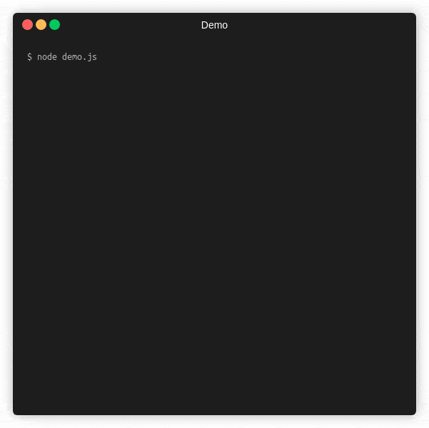

<div align="center">

# @opentf/cli-pbar

⚡ by [OPEN TECH FOUNDATION](https://open-tech-foundation.pages.dev/)

</div>

[](https://github.com/open-tech-foundation/cli-progress-bar/actions/workflows/build.yml)

<div align="center">



</div>

> CLI progress bar.

## Features

- Single & Multi progress bar

- Custom bar colors

- Multiple sizes

## Installation

```bash
npm install @opentf/cli-pbar
```

```bash
yarn add @opentf/cli-pbar
```

```bash
pnpm add @opentf/cli-pbar
```

## Syntax

```ts
new ProgressBar(options?: Options)
```

## Usage

Single progress bar.

```ts
import { ProgressBar } from '@opentf/cli-pbar';

const pBar = new ProgressBar();
pBar.start({ total: 100 });
pBar.update({ value: 50 });
pBar.update({ value: 100 });
pBar.stop();
```

Multi progress bar.

```ts
import { ProgressBar } from '@opentf/cli-pbar';

const multiPBar = new ProgressBar();
multiPBar.start();
const b1 = multiPBar.add({ total: 100 });
const b2 = multiPBar.add({ total: 100 });
const b3 = multiPBar.add({ total: 100 });
b1.update({ value: 23 });
b3.update({ value: 35 });
b2.update({ value: 17 });
multiPBar.stop();
```

## API

### options:

| Name      | Type               | Default        | Description                                                                                                                                                                                                                                                                                                                                              |
| --------- | ------------------ | -------------- | -------------------------------------------------------------------------------------------------------------------------------------------------------------------------------------------------------------------------------------------------------------------------------------------------------------------------------------------------------- |
| stream    | NodeJS.WriteStream | process.stderr | The stream to use.                                                                                                                                                                                                                                                                                                                                       |
| width     | number             | 30             | The size of the progress bar.                                                                                                                                                                                                                                                                                                                            |
| prefix    | string             | ''             | The string to be prefixed progress bar.                                                                                                                                                                                                                                                                                                                  |
| suffix    | string             | ''             | The string to be suffixed progress bar.                                                                                                                                                                                                                                                                                                                  |
| color     | string             | 'g'            | The color to render the completed progress bar.<br />The default color is `green`.<br /> It uses [@opentf/cli-styles](https://www.npmjs.com/package/@opentf/cli-styles) for colors.<br />You can also use the `rgb` & `hex` color modes, please refer the [supported color keys here](https://github.com/open-tech-foundation/js-cli-styles#color-keys). |
| bgColor   | string             | 'gr'           | The color to render the incomplete progress bar.<br />The default color is `grey`.<br /> It uses [@opentf/cli-styles](https://www.npmjs.com/package/@opentf/cli-styles) for colors.<br />You can also use the `rgb` & `hex` color modes, please refer the [supported color keys here](https://github.com/open-tech-foundation/js-cli-styles#color-keys). |
| size      | string             | 'DEFAULT'      | The size of the progress bar to render.<br />Available sizes:<br/>'DEFAULT'<br/>'MEDIUM'<br/>'SMALL'                                                                                                                                                                                                                                                     |
| autoClear | boolean            | false          | If true, then it auto-clears the progress bar after the `stop` method is called.                                                                                                                                                                                                                                                                         |

### Instance methods:

**start(obj?: Partial<Bar\>): void**

After the method is called, the progress bar starts rendering.

#### Bar:

| Name     | Type    | Default   | Description                                                                                                                                                                                                                                                                                                                                              |
| -------- | ------- | --------- | -------------------------------------------------------------------------------------------------------------------------------------------------------------------------------------------------------------------------------------------------------------------------------------------------------------------------------------------------------- |
| total    | number  | NaN       | The total value for the progress bar.                                                                                                                                                                                                                                                                                                                    |
| value    | number  | NaN       | The current value of the progress bar.                                                                                                                                                                                                                                                                                                                   |
| prefix   | string  | ''        | The string to be prefixed progress bar.                                                                                                                                                                                                                                                                                                                  |
| suffix   | string  | ''        | The string to be suffixed progress bar.                                                                                                                                                                                                                                                                                                                  |
| color    | string  | 'g'       | The color to render the completed progress bar.<br />The default color is `green`.<br /> It uses [@opentf/cli-styles](https://www.npmjs.com/package/@opentf/cli-styles) for colors.<br />You can also use the `rgb` & `hex` color modes, please refer the [supported color keys here](https://github.com/open-tech-foundation/js-cli-styles#color-keys). |
| bgColor  | string  | 'gr'      | The color to render the incomplete progress bar.<br />The default color is `grey`.<br /> It uses [@opentf/cli-styles](https://www.npmjs.com/package/@opentf/cli-styles) for colors.<br />You can also use the `rgb` & `hex` color modes, please refer the [supported color keys here](https://github.com/open-tech-foundation/js-cli-styles#color-keys). |
| size     | string  | 'DEFAULT' | The size of the progress bar.<br />Available sizes:<br/>'DEFAULT'<br/>'MEDIUM'<br/>'SMALL'                                                                                                                                                                                                                                                               |
| progress | boolean | true      | If `false`, it does not render a progress bar, making it useful to add an empty line or text without displaying a progress bar.                                                                                                                                                                                                                          |

**add(obj: Partial<Bar\>): { update: (obj: Partial<Bar\>) => void }**

In `multi-progress` bars, it appends a progress bar to the container and returns an object with a method to update it.

**update(obj: Partial<Bar\>): void**

In updates the current progress bar instance.

**stop(msg?: string): void**

Stops the current progress bar instance with the current state and optionally clears the progress bar when `autoClear` is true.

You can also pass `msg` text to be displayed after the instance stops.

## Related

- [@opentf/utils](https://www.npmjs.com/package/@opentf/utils) - A collection of JavaScript utility functions.

- [@opentf/cli-styles](https://www.npmjs.com/package/@opentf/cli-styles) - Style your CLI text using ANSI escape sequences.

## License

Copyright (c) 2021, [Thanga Ganapathy](https://thanga-ganapathy.github.io) ([MIT License](./LICENSE)).
