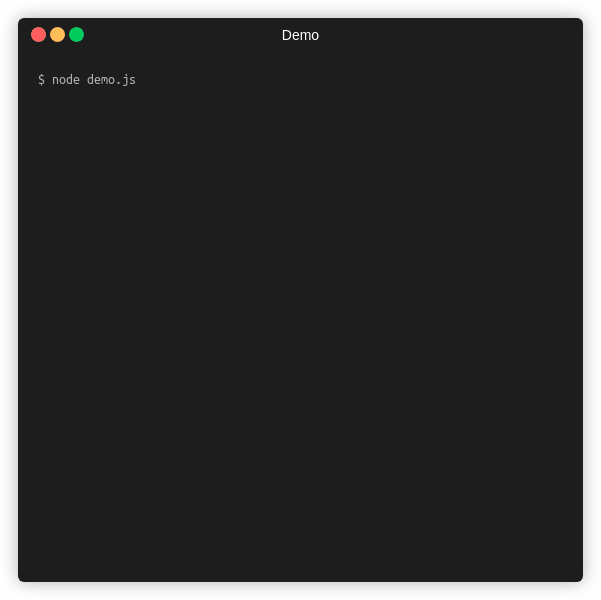

<div align="center">

# @open-tech-world/cli-progress-bar
[](https://github.com/open-tech-world/cli-progress-bar/actions/workflows/build.yml) [](https://www.codefactor.io/repository/github/open-tech-world/cli-progress-bar)


 

</div>

> Node.js CLI progress bar.

## Installation

Using npm

```bash
$ npm install @open-tech-world/cli-progress-bar
```

Using Yarn

```bash
$ yarn add @open-tech-world/cli-progress-bar
```

## Usage

```ts
import { ProgressBar } from '@open-tech-world/cli-progress-bar';

const pBar = new ProgressBar();
pBar.run({value: 0, total: 100, prefix: 'Downloading'});
pBar.run({value: 50, total: 100, prefix: 'Downloading'});
pBar.run({value: 100, total: 100, prefix: 'Download Completed!'});
```

## API

**new ProgressBar(Partial\<IOptions\>)**

It creates a new instance of the `ProgressBar`.

options:

| Name | Type | Default | Description |
| ---- | ---- | ------- | ----------- |
| stream | NodeJS.WriteStream | process.stderr | The stream to use.
| width | number | 30 | The size of the progress bar.
| prefix | string | '' | The string to be prefixed progress bar.
| suffix | string | '' | The string to be suffixed progress bar.
| color | string | 'green' | The color to render the progress bar. See the [supported color names here](https://github.com/open-tech-world/es-cli-styles#style-names).
| autoClear | boolean | false | If true, then it auto clears the progress bar when it reaches `100%`.

#### Instance methods:

**run(options): void**

Runs the current progress bar instance with the given values & options.

options:

| Name | Type | Default | Description |
| ---- | ---- | ------- | ----------- |
| value | number | NaN | The current value of the progress bar.
| total | number | NaN | The total value for the progress bar.
| prefix | string | '' | The string to be prefixed progress bar.
| suffix | string | '' | The string to be suffixed progress bar.
| color | string | 'green' | The color to render the progress bar. See the [supported color names here](https://github.com/open-tech-world/es-cli-styles#style-names).

**stop(clear = false): void**

Stops the current progress bar instance with the current state and optionally clears the progress bar.

```ts
pBar.stop(); // It just stops the progress bar.

pBar.stop(true); // It stops & removes the progress bar.
```

## License

Copyright (c) 2021, [Thanga Ganapathy](https://thanga-ganapathy.github.io) ([MIT License](./LICENSE)).

